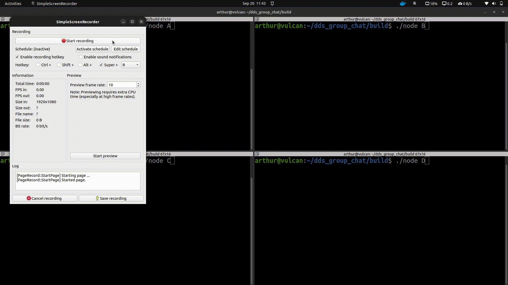

# dds_group_chat
A tty group chat application build using eProsima's FASTDDS

## Install dependencies
* install FastDDS from eProsima's [website](https://fast-dds.docs.eprosima.com/en/v2.0.0/installation/binaries/binaries.html). 
* ensure that all build tools are available. `sudo apt install build-essential make cmake`.

## build project
* Clone the repo. Move to root of repo.
* `mkdir build && cd build`
* `cmake -S .. -B . && make`

## Run the project
* launch a group chat participant with `./node <node name>`. For eg: `./node participant_A`.
* open more participants from other terminals.

